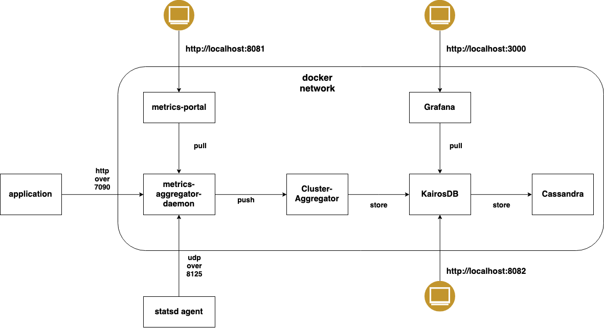

# MAD for Dev

# Purpose

To provide a [`Metrics Aggregator Daemon`](https://github.com/ArpNetworking/metrics-aggregator-daemon) based metrics collection and visualization solution suitable for development environment.

Implementation of the solution is based on docker and to be used by `docker-compose`.




## Caution

Not suitable for production use. No metrics data is retained. No high availability. Dashboard and data source configuration are not persisted.


# Run It

From the top directory,

```
docker-compose -f docker-compose.yml up -d
```


# Metrics Aggregator Daemon (MAD)

MAD is available at port `7090` and `8125` (udp)

# Metrics Portal (mportal)

mportal is available at port `8080` and `9000` and UI is available at `localhost:8081`

By default, metrics from both `MAD` and `mportal` are available and shown in the left panel.


When application/service is pushing metrics to `MAD` with `service` tag of value `ams`, then metrics will show up under `ams` as well.


# Metrics Cluster Aggregator (CAGG)

CAGG is available at port `7065` and `7066`.

# Cassandra

Cassandra is available at port `7000` and `9042`.

# KairosDB

Kairosdb is available at port `8080` and UI is available at `localhost:8082`


# Grafana 

Grafana is available at port `3000` and UI is available at `localhost:3000`

## Grafana Data Source Configuration

Grafana has had Kairosdb plugin installed. All is left is to configure data source


# Integration With Spring Boot Application

In the `application.yaml` file, enable statsd metrics.

```
management:
  metrics:
    export:
      statsd:
        enabled: true
        flavor: datadog
        host: "localhost"
        port: 8125
      simple:
        enabled: false
```

In order for MAD to correctly ingest metrics, the following 3 tags must be present in the metric.

* cluster: value of `monitoringCluster` variable configured in [config.conf](./mad/config/config.conf), default is "mad"
* service: name of your service
* host: localhost or something similar

